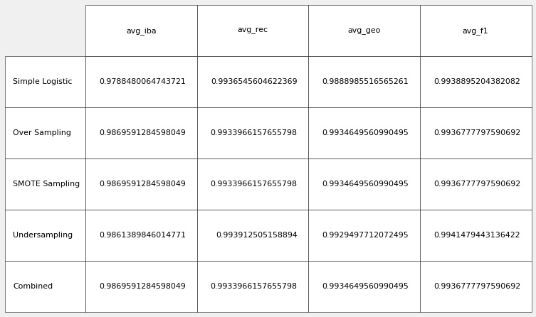

# Unit 11 - Risky Business
 

## Background

Mortgages, student and auto loans, and debt consolidation are just a few examples of credit and loans that people seek online. Peer-to-peer lending services such as Loans Canada and Mogo let investors loan people money without using a bank. However, because investors always want to mitigate risk, a client has asked that you help them predict credit risk with machine learning techniques.

The assignment was to build and evaluate several machine learning models to predict credit risk using data you'd typically see from peer-to-peer lending services. Credit risk is an inherently imbalanced classification problem (the number of good loans is much larger than the number of at-risk loans), so you will need to employ different techniques for training and evaluating models with imbalanced classes. Used imbalanced-learn and Scikit-learn libraries to build and evaluate models using the two following techniques:
1. [Resampling](#Resampling)
2. [Ensemble Learning](#Ensemble-Learning)

## Submission Files

[Resampling  Notebook](Submission/credit_risk_resampling.ipynb)

[Ensemble  Notebook](Submission/credit_risk_ensemble.ipynb)

### Resampling
Used [imbalanced learn](https://imbalanced-learn.readthedocs.io) library to resample the LendingClub data and build and evaluate logistic regression classifiers using the resampled data.

---

#### Model summary

---
#### Final Questions

1. Which model had the best balanced accuracy score?

   Over sampling, SMOTE sampling and Combibed Sampling Performed best with a balanced accuracy score of 0.986959

2. Which model had the best recall score?

   Under sampling performed best with a recall score of 0.993913. Simply printing the classification report shows the values rounded off to two decimal places but extration of the complete metric show that thi model performs slightly better.

3. Which model had the best geometric mean score?

    Over sampling, SMOTE sampling and Combibed Sampling Performed best with a geometric mean score of 0.993465

Reference : Scikit:The best value is 1 and the worst value is 0. 

---

### Ensemble-Learning
Trained and compared two different ensemble classifiers to predict loan risk and evaluate each model.
- [x] [Balanced Random Forest Classifier](https://imbalanced-learn.readthedocs.io/en/stable/generated/imblearn.ensemble.BalancedRandomForestClassifier.html#imblearn-ensemble-balancedrandomforestclassifier)
- [x] [Easy Ensemble Classifier](https://imbalanced-learn.readthedocs.io/en/stable/generated/imblearn.ensemble.EasyEnsembleClassifier.html#imblearn-ensemble-easyensembleclassifier). 

#### Model summary

--- 

#### Top Three Features

#### All Features Ranked(#AllFeatures)

### Final Questions

1. Which model had the best balanced accuracy score?

    Easy Ensemble Classifier has the balanced accuracy score of 0.869619

2. Which model had the best recall score?

    Easy Ensemble Classifier has the best recall score of 0.942284

3. Which model had the best geometric mean score?

    Easy Ensemble Classifier has the best geometric mean score of 0.931539

4. What are the top three features?

    The top three features are total_rec_prncp, total_pymnt and total_pymnt_inv with importance percentage of  7.876809 % , 5.883807 % and 5.625614 % respectively.

Reference : Scikit:The best value is 1 and the worst value is 0. 

### AllFeatures

The figure below shows all the features and their corresponding importance:

